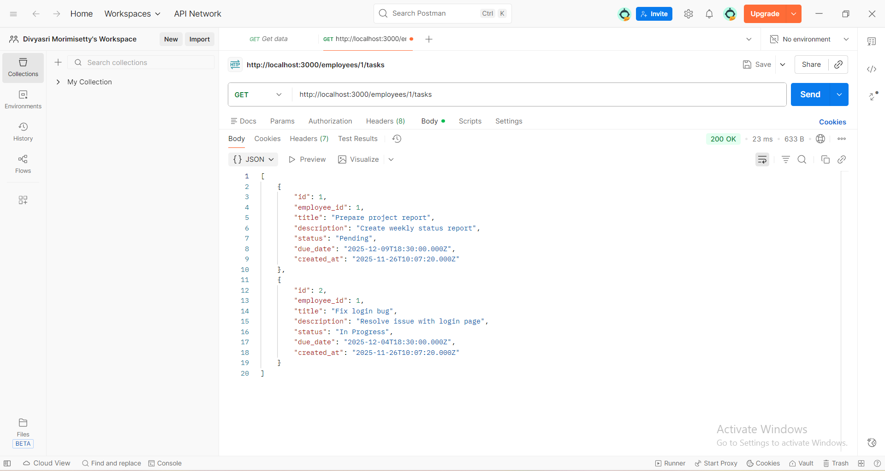
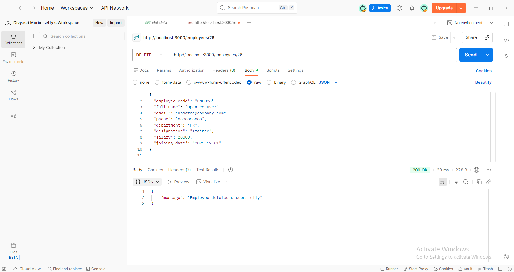

# Employee & Task Management System     
A full-stack web application that manages employees and their tasks using RESTful APIs, MySQL database and a frontend UI.

# Project Features
## Employee Module
- Add employee
- View all employees
- Update employee information
- Delete employee
## Task Module
- Create new task
- View all tasks
- View tasks for a specific employee
- Update task details
- Delete tasks
- Task automatically removed when employee is deleted (Foreign Key)

# Tech Stack Used
## Backend
- Node.js
- MySQL
- mysql2 package
## Frontend
- HTML
- CSS
- JavaScript (Fetch API)
## Tools
- VS Code
- MySQL Workbench
- Postman
- Browser (Chrome / Edge)

# Setup Instructions
## Clone or Download Project
Place the folder on your Desktop.

## Install Node Modules
Open terminal inside project folder:
npm install

## MySQL Database Setup
Create database:
CREATE DATABASE company;
USE company;

Create employee table:
CREATE TABLE employees (
    id INT AUTO_INCREMENT PRIMARY KEY,
    employee_code VARCHAR(10),
    full_name VARCHAR(50),
    email VARCHAR(100),
    phone VARCHAR(15),
    department VARCHAR(50),
    designation VARCHAR(50),
    salary INT,
    joining_date DATE
);

Create task table:
CREATE TABLE tasks (
    id INT AUTO_INCREMENT PRIMARY KEY,
    employee_id INT,
    title VARCHAR(100),
    description TEXT,
    status VARCHAR(20),
    due_date DATE,
    created_at TIMESTAMP DEFAULT CURRENT_TIMESTAMP,
    FOREIGN KEY (employee_id) REFERENCES employees(id) ON DELETE CASCADE
);

## Update Database Credentials
In server.js:
const db = mysql.createConnection({
    host: "127.0.0.1",
    user: "root",
    password: "Divyasri@2004",
    database: "company",
    port: 3306
});

## Run the Backend Server
node server.js
# Output:
DB connected successfully
Server running at http://localhost:3000

## Run Frontend
Open in browser:
frontend/index.html

## Testing
All APIs were tested using:
- Postman
- Browser
- Frontend UI forms

## Assumptions
- One employee can have many tasks
- Task cannot exist without employee
- Employee deletion removes assigned tasks
- No login / authentication implemented
- Single user system
- Runs on localhost

## Bonus Features Implemented
- Relationship between Employees and Tasks
- UI connected to backend
- CSS styled modern interface
- Dropdown-like navigation
- Foreign key cascading delete
- JSON-based APIs
- Responsive layout
- CORS handling
- Separate pages for employees & tasks

## Conclusion
- This project demonstrates strong understanding of:
- REST API design
- CRUD operations
- MySQL relational schema
- Frontend-to-backend communication
- Real-world full-stack workflow

## Pictures for reference:
## Creating an Employee and a Task

## Retriving

## Deleting

## Updation

## Demo video
[frontend
](https://github.com/DivyasriMorimisetty/Backend---API-Development-API-Database-/blob/main/frontend/Testing%20the%20project.mp4)

